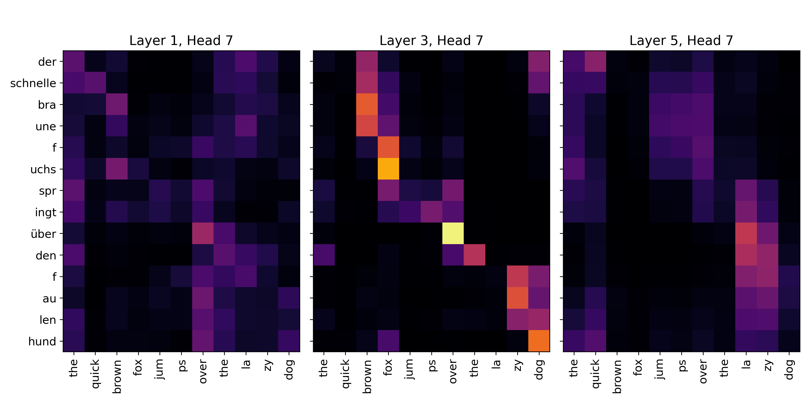

# Attention Is All You Need

This repository contains my personal implementation of **Attention Is All You Need** in PyTorch. The project covers training on the **WMT 2014 English→German** translation benchmark with evaluation using the **BLEU** score against the [official Transformer implementation](https://github.com/tensorflow/tensor2tensor).
## 🌟 Introduction

The **Transformer** architecture represents a pivotal shift in sequence modeling, replacing recurrent and convolutional mechanisms with a pure attention-based framework. Introduced by [Vaswani et al. (2017)](https://arxiv.org/abs/1706.03762), the core innovation lies in the **attention** mechanism, which enables each element in a sequence to directly attend to every other element, regardless of distance. This departure from recurrence allows for highly parallelizable training and significantly improved efficiency in capturing long-range dependencies.  

The general-purpose nature of the Transformer, combined with its scalability, has enabled it to achieve **state-of-the-art performance** across a wide spectrum of tasks in **natural language processing**, vision, and beyond, establishing attention as the fundamental building block of modern deep learning systems.

This project is a **ground-up Pytorch implementation**, aiming to:
- Describe the Transformer architecture
- Reimplement the original Transformer from scratch
- Train the model on the WMT14 English→German dataset
- Compare performance with the official Transformer implementation
## 🏗️ Model Overview

### Tokenization

Raw text is tokenized using **Byte Pair Encoding (BPE)** with a shared vocabulary of $V$ tokens. Without any loss of generality, the tokenization step can be described as an operation that maps a sequence of characters $\mathbf{w}$ into a sequence of integers $\mathbf{x}$:
```math
\mathrm{Tokenizer}: \mathbf{w}=[w_1,\ldots,w_N] \to \mathbf{x}=[x_1,\ldots,x_T]
```
where $x_t\in\{0,\ldots,V-1\}$ and $N\geq T$. 
### Token embedding

A **learned embedding** $\mathbf{E} \in \mathbb{R}^{V \times d_\mathrm{model}}$ projects discrete token IDs into a continuous vector space of fixed dimensionality $d_\mathrm{model}$
### Positional encoding

Sinusoidal **positional encodings** $\mathbf{R} \in \mathbb{R}^{T \times d_\mathrm{model}}$ are added to the input embeddings to inject information about the absolute and relative positions of the tokens in the sequence. Formally:
```math
r_{ti} =
\begin{cases}
\sin{\left(\frac{t}{L^{2i/d_\mathrm{model}}}\right)} & \text{if } i \text{ is even} \\
\cos{\left(\frac{t}{L^{2i/d_\mathrm{model}}}\right)} & \text{if } i \text{ is odd}
\end{cases}
```
where $t\in[0,T)$ is the token position, $i\in[0,\lfloor d_\mathrm{model}/2 \rfloor -1)$ refers to the embedding dimension, and $L$ is a hyperparameter that forces the wavelengths to exhibit a geometric progression from $2\pi$ to $2\pi L$.
### Attention

The encoder and decoder stacks rely on the mechanism of **attention**, which can be described as mapping a query and a set of key-value pairs to an output. The output is computed as a weighted sum of the values, where the weights assigned to each value is computed by a similarity function of the query and the corresponding key. 

Given input embeddings $\mathbf{X}\in\mathbb{R}^{T\times d_\mathrm{model}}$, queries, keys, and values are obtained via learned projections:
```math
\mathbf{Q}=\mathbf{X}\mathbf{W}^{(q)},\quad 
\mathbf{K}=\mathbf{X}\mathbf{W}^{(k)},\quad 
\mathbf{V}=\mathbf{X}\mathbf{W}^{(v)}
```
with $\mathbf{Q},\mathbf{K}\in\mathbb{R}^{T\times d_k}$ and $\mathbf{V}\in\mathbb{R}^{T\times d_v}$. The factor $1/\sqrt{d_k}$ is included to stabilize gradients by normalizing dot product variance. The results is what we refer to **scaled dot-product attention**:
```math
\mathrm{Attention}(\mathbf{Q},\mathbf{K},\mathbf{V})
= \mathrm{softmax}\!\left(\tfrac{\mathbf{Q}\mathbf{K}^\top}{\sqrt{d_k}}\right)\mathbf{V}
```
### Multi-head attention

To capture multiple representation subspaces, queries, keys, and values are projected $H$ times:
```math
\mathbf{Q}_h=\mathbf{X}\mathbf{W}_h^{(q)},\quad 
\mathbf{K}_h=\mathbf{X}\mathbf{W}_h^{(k)},\quad 
\mathbf{V}_h=\mathbf{X}\mathbf{W}_h^{(v)},\quad h=1,\dots,H
```
Each head computes:
```math
\mathbf{H}_h=\mathrm{Attention}(\mathbf{Q}_h,\mathbf{K}_h,\mathbf{V}_h)
```
The outputs are concatenated and projected, yielding **multi-head attention**:
```math
\mathrm{MultiHead}(\mathbf{Q},\mathbf{K},\mathbf{V})
=\mathrm{Concat}[\mathbf{H}_1,\ldots,\mathbf{H}_H]\mathbf{W}^{(o)}
```
with $\mathbf{W}^{(o)}\in\mathbb{R}^{(Hd_v)\times d_\mathrm{model}}$ and $d_k=d_v=d_\mathrm{model}/H$. 
### Causal Masking

**Causal masking** is applied to the self-attention layers of the decoder stack to prevent tokens from attend to tokens later in the sequence. This is achieved by setting to to zero all the attention coefficients that correspond to a token attending to any later token in the sequence. In practice, this is achieved by setting the pre-activations corresponding to illegal connections to $-\infty$. We let $\mathbf{M} \in \mathbb{R}^{T \times T}$ be a mask matrix with entries:
```math
M_{ij} = 
\begin{cases}
0 && \text{if } j \leq i \\
-\infty && \text{if } j > i
\end{cases}
```
Then the masked attention head is defined as:
```math
\mathrm{MaskedAttention}(\mathbf{Q},\mathbf{K},\mathbf{V}) = \mathrm{softmax}\left( \frac{\mathbf{Q}\mathbf{K}^\mathrm{T}}{\sqrt{d_k}} + \mathbf{M}\right) \mathbf{V}
```
Here, the mask $\mathbf{M}$ is added element-wise to the attention logits. The entries with $-\infty$ become zero after softmax since $\exp(-\infty)=0$, ensuring that token $i$ only attends to tokens $j\leq i$.
### Feed-forward newtork

Each layer in the encoder and decoder also contains a fully-connected feed-forward network whose aim is to map the information learned by the attention layers into a more nonlinear and expressive space. Given an input matrix $\mathbf{X}\in\mathbb{R}^{T\times d_\mathrm{model}}$ (from the attention sublayer), the feed-forward network is given by:
```math
\mathrm{FFN}(\mathbf{X}) = \mathrm{ReLU}(\mathbf{X}\mathbf{W}_1+\mathbf{b}_1)\mathbf{W}_2+\mathbf{b}_2
```
where $\mathbf{W}$ and $\mathbf{b}$ denote the weights and biases of the linear layers, respectively, with an inner dimensionality of $d_\mathrm{ff}$.
### Residual connections & layer normalization

A **residual connection** followed by **layer normalization** is employed around the attention and feed-forward sublayers so that we can stack several encoder and decoder layers on top of each other while avoiding any pitfalls during training. Without any loss of generality, this can be expressed as:
```math
\mathbf{X}' = \mathrm{LayerNorm}(\mathbf{X}+\mathrm{Sublayer}(\mathbf{X}))
```
where $\mathbf{X} \in \mathbb{R}^{T \times d_\mathrm{model}}$ denotes the input and $\mathrm{Sublayer}$ is given by either $\mathrm{MultiHead}$ or $\mathrm{FFN}$. Note that this operations retain the dimensionality of the inputs.
### Linear + softmax layer

A learned **linear** transformation and a **softmax** function are used to convert the decoder output to predicted next-token probabilities. Given the output of the decoder stack $\mathbf{Z}\in\mathbb{R}^{T \times d_\mathrm{model}}$, the linear transformation yields the logits:
```math
\mathbf{Z}' = \mathbf{Z}\mathbf{W}^{(p)}+\mathbf{b}^{(p)}
```
where $\mathbf{W}^{(p)}\in\mathbb{R}^{d_\mathrm{model}\times V}$ is the learned projection mapping from model space to vocabulary space. Instead learning $\mathbf{W}^{(p)}$ separately, we apply **weight sharing** and reuse the transposed embedding matrix, reducing the total number of trainable parameters and promoting symmetry between the input and output representations.

The softmax function is then applied row-wise over the vocabulary dimension to yield the predicted token probabilities over every position in the sequence:
```math
\mathbf{P} = \mathrm{softmax}(\mathbf{Z}') = \mathrm{softmax}\left(\mathbf{Z}\mathbf{W}^{(p)}+\mathbf{b}^{(p)}\right)
```
where both the logits $\mathbf{Z}'$ and the next-token probabilities $\mathbf{P}$ have dimensionality $T\times V$.
## 🏋️‍♂️ Training

### Loss function & label smoothing

The **cross-entropy loss function** is used to compare the predicted probability distribution over the vocabulary at each position against the ground-truth token at that position. **Label smoothing** was applied so that most of the probability mass is assigned to the correct class but a small portion is distributed uniformly over all classes:
```math
\tilde{\mathbf{y}}_{t,i} = 
\begin{cases}
1-\epsilon+\frac{\epsilon}{V}, && \text{if } i=y_t \\
\frac{\epsilon}{V}, && \text{otherwise}
\end{cases}
```
where $\epsilon=0.1$. This technique prevents overconfidence and improves generalization.
### Dropout

**Dropout** with a rate of $P_\mathrm{drop}=0.1$ is applied to the output of each sublayer (before normalization) and to the sums of the embeddings and positional encodings in both the encoder and decoder stacks.
### Optimizer and learning rate

The **Adam** optimizer with $\beta_1=0.9$, $\beta_2=0.98$, and $\epsilon=10^{-8}$ was used during training with a **learning rate** characterized by a **linear warmup** over $T_\mathrm{warmup}=4,000$ steps followed by an inverse square root decay:
```math
\eta(t) = \frac{1}{\sqrt{d_\mathrm{model}}}\cdot\min\left(\frac{1}{\sqrt{t}},t\cdot T_\mathrm{warmup} \right)
```
### ⚡️ Inference

**Beam search** with a beam size of $b=4$ and a length penalty of $\alpha=0.6$ was used to select the next-token ID from the predicted next-token probability. The chosen token ID is then **de-tokenized** using the inverse of the BPE algorithm to generate the output text. Generation proceeds **autoregressively** until either an end-of-sequence token `</s>` is produced or predefined maximum sequence length `max_len` is reached, at which point the decoding process terminates.
## 🔍 Implementation Details

- The WMT14 dataset was downloaed using the 🤗 `datasets` library from https://huggingface.co/datasets/wmt/wmt14
- Tokenization was handled via the 🤗 `tokenizers` library, using a `BPE` tokenizer with `Whitespace` pre-tokenization and the special tokens `["<s>", "<pad>", "</s>", "<unk>"]`
- Batches were contructed dynamically to ensure the model sees ~20K non-padding tokens at each training step
- Decoded ouputs were detokenized using `MosesDetokenizer` from the `sacremoses` library
- BLEU scores where computed using the `sacrebleu` metric from the 🤗 `evaluate library`
## ⚙️ Installation

**1. Clone the repository**

```bash
git clone https://github.com/rplacucci/attention-is-all-you-need.git
cd attention-is-all-you-need
```

**2. Setup the local environment**

```bash
python -m venv .venv
source .venv/bin/activate
```

**3. Install dependencies**

```bash
pip install -r requirements.txt
```
## 🚀 Usage

### Training

Build a shared vocabulary:
```bash
python -m vocab.build_vocab --src_lang=en --tgt_lang=de --vocab_size=37000 --min_frequency=2 
```

Calculate the per-example token ID lengths for dynamic batching:
```bash
python -m vocab.survey --src_lang=en --tgt_lang=de
```

Train on the WMT14 English→German benchmark:
```bash
torchrun --standalone --nproc-per-node=4 -m scripts.train --model_config=base --src_lang=en --tgt_lang=de
```

Monitor the training progress via `tensorboard`:
```bash
tensorboard --logdir=logs
```
### Evaluation

Evaluate on the BLEU metric:
```bash
torchrun --standalone --nproc-per-node=1 -m scripts.test --model_config=base --src_lang=en --tgt_lang=de
```

Plot attention maps across several Transformer layers:
```bash
python -m outputs.plot_attn --src_lang=en --tgt_lang=de
```
### Key options

Adjust the training and evaluation routines with the following parameters according to you computational resources:
- `--src_language` source language (default: `en`)
- `--tgt_language` target language (default: `de`)
- `--vocab_size` size of shared token vocabulary (default: `37000`)
- `--min_frequency` minimum number of BPE merges (default: `2`)
- `--nproc-per-node` number of GPUs to train with (default: `4`)
- `--model_config` Transformer architecture (default: `base`)
- `--batch_size` number of samples per validation step (default: `32`)
- `--grad_accum_steps` number of gradient accumulation steps (default: `1`)
- `--logdir` directory where `tensorboard` saves log files (default: `logs`)

All other parameters (e.g., number of training steps, tokens per batch, label smoothing, etc.) have been hard-coded to mimic the original implementation by Vaswani et al.
## 📊 Results

### Training loss
The validation cross-entropy loss exhibits the typical learning behavior for a Transformer model:
- The initial loss (not shown) is approximately $\log V \approx 11$ (with vocabulary size $V=37,000$), which reflects the entropy of random token prediction.
- The model undergoes a steep decline in the first ~10k steps as it rapidly acquires shallow lexical and syntactic regularities.
- By ~30k steps the rate of improvement slows markedly and the loss plateaus near 2.8


**Note:** Each training run took ~9.5 hours on 4 NVIDIA A40 GPUs.
### BLEU evaluation

The following table summarizes BLEU scores on the **WMT14 English→German** test set for several well-known sequence-to-sequence models, compared against this implementation:

|**Model**                   | **BLEU** |
| :------------------------- | :------: |
| ByteNet                    | 23.8     |
| GNMT + RL                  | 24.6     |
| ConvS2S                    | 25.2     |
| MoE                        | 26.0     |
| GMNT + RL Ensemble         | 26.3     |
| ConvS2S Ensemble           | 26.4     |
| Tranformer (base)          | 27.3     |
| Transforer (big)           | 28.4     |
| *My Transformer (base)*    | *31.2*   |

Overall, this implementation achieves **31.2 sacreBLEU**, which is **3-4 BLEU higher** than the original Transformer-base and competitive with or surpassing the Transformer big baseline. This difference in performance can be explained by a number of reasons:
- The original Transformer results reported in Vaswani et al. (2017) used a slightly smaller preprocessed WMT14 dataset and multi-bleu.perl for evaluation, whereas this implementation uses the 🤗 WMT14 dataset and sacreBLEU, which standardizes tokenization
- While this implementation used the same hyperparameters for preprocessing (e.g., subword tokenization marges) and decoding (e.g., beam size, length penalty, etc.), variations in the dataset could have yielded a gain of several BLEU points
- Modern training infrastructure (using Pytorch v2.8 vs TensorFlow v1.2-1.4) also tends to stabilize optimization and improve results

Overall, while absolute values differ due to these factors, the results agree with the trends reported in Vaswani et al.; moreover, the sacreBLEU score for **German→English** translation is higher at **33.9**, which is consistent with other implementations.
## Attention Maps

The correctness of this implementation can be further validated by inspecting the **attention maps** and confirming whether they qualitatively align with the findings reported by Vaswani et al. (2017) and the papers that followed. Below is a summary of the key results from this implementation, using the example sentence pair:
```
English: the quick brown fox jumps over the lazy dog
German: der schnelle braune Fuchs springt über den faulen Hund
```
### Encoder self-attention

The encoder layers show the expected progression from local to global context:
- Early layers: Strong diagonal pattern → tokens attend mostly to themselves and close neighbors
- Middle layers: Mixture of local and long-range heads → phrase-level dependencies emerge (e.g., adjective–noun pairs)
- Late layers: Sparser, more specialized heads → capture long-distance dependencies and global semantics


### Decoder self-attention (masked)

Decoder self-attention is causal, so tokens only attend to previous ones. The maps reveal:
- Early layers: Local context focus → next-word prediction relies on immediate neighbors
- Middle layers: Broader context integration → phrase-level cohesion
- Late layers: Targeted long-range dependencies → attention stays relatively sharp, but specific heads specialize in linking distant yet semantically critical tokens (e.g., subject–verb agreement, clause-level context)


### Decoder cross-attention

Cross-attention aligns target tokens with source tokens. Behavior closely mirrors neural machine translation alignments:
- Early layers: Noisy alignments, but early word-to-word links appear
- Middle layers: Clearer phrase-level alignments
- Late layers: Stable, specialized heads → combine sharp lexical alignment with broad semantic context



These visualizations confirm that the implementation faithfully reproduces the qualitative behaviors of the original Transformer
## 🔮 Future Work

- Implement baseline based on 🤗 `transformers`
- Train and evaluate other model configurations (e.g., with `model_config=big`)
- Extend translation to other languages (e.g., French, Czech, etc.)
- Experiment with other decoding strategies
## 📚 References

- Vaswani, A., et al. (2017). *Attention is All You Need*.
- Rush, A. (2018). *The Annotated Transformer*. Retrieved from [https://nlp.seas.harvard.edu/2018/04/03/attention.html](https://nlp.seas.harvard.edu/2018/04/03/attention.html)
- Papineni, K., Roukos, S., Ward, T., & Zhu, W. J. (2002). *BLEU: a Method for Automatic Evaluation of Machine Translation*.
